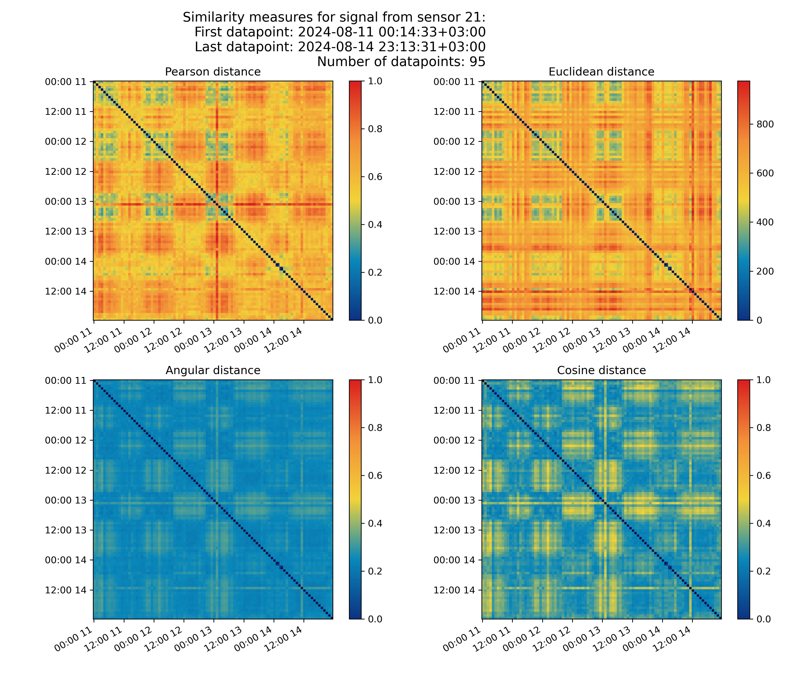

This project shows how we analyse data from our beehives. Сontinuously updated results from our sensors are here: https://evgenii-barannik.github.io/interactive-bees/

One example visualization is shown below. See [website]( https://evgenii-barannik.github.io/interactive-bees/) for more info about this plot!

