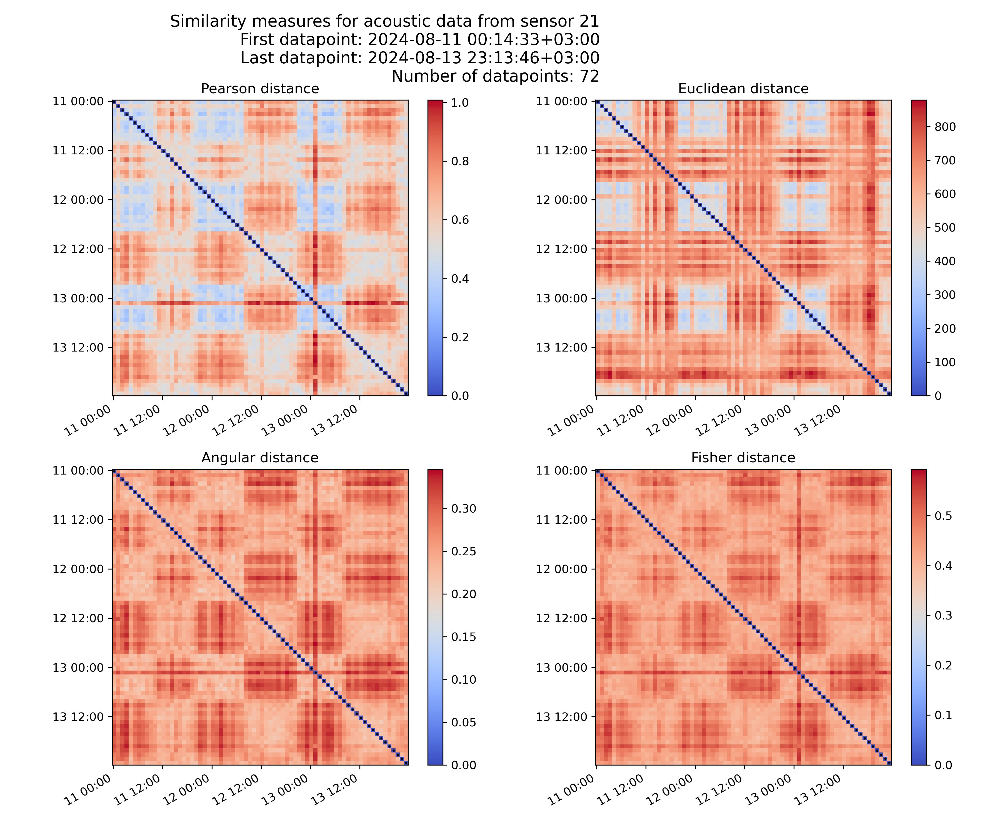
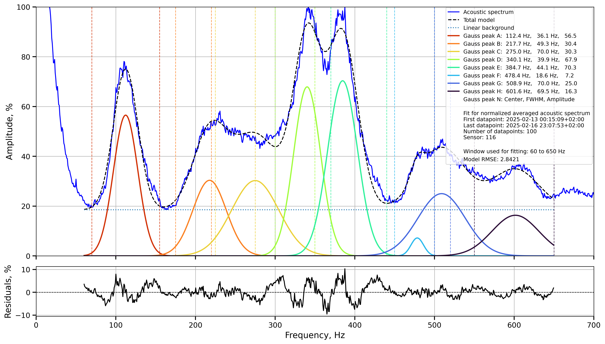
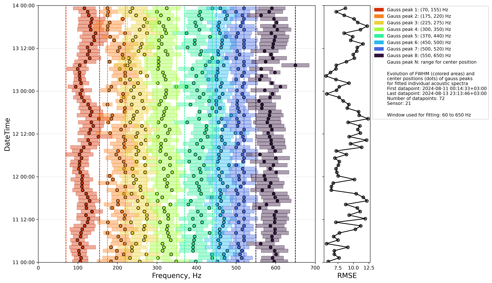

This project shows how we analyse data from our beehives. Сontinuously updated results from our sensors are here: https://zhenya-barannik.github.io/interactive-bees/

Several example visualizations are shown below.

